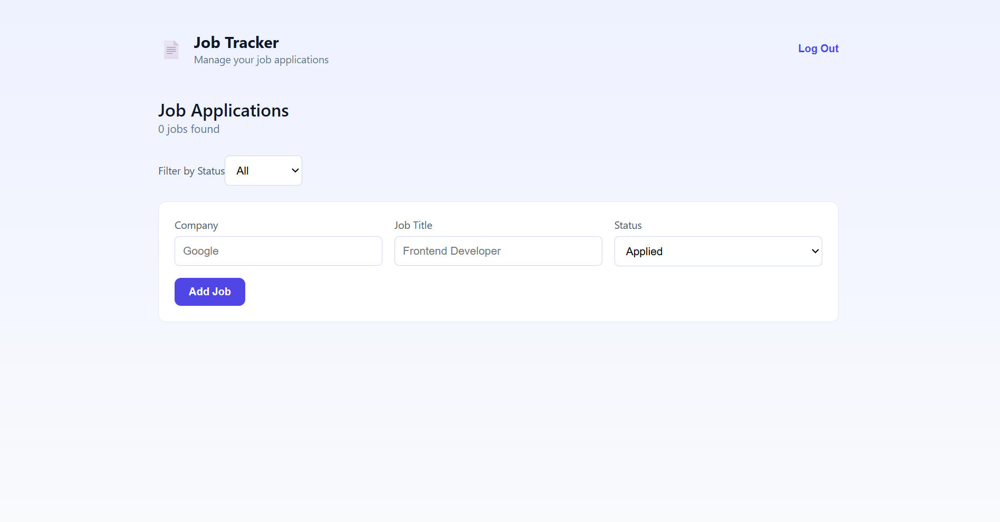
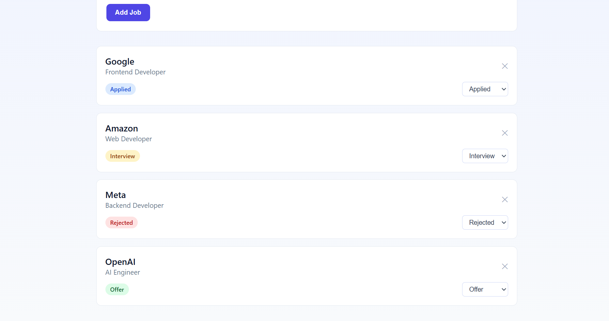
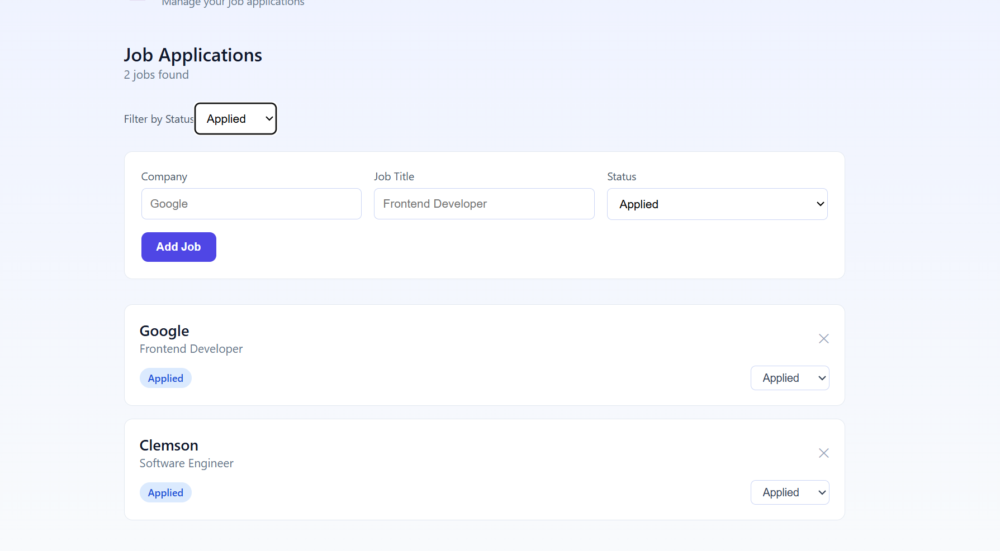
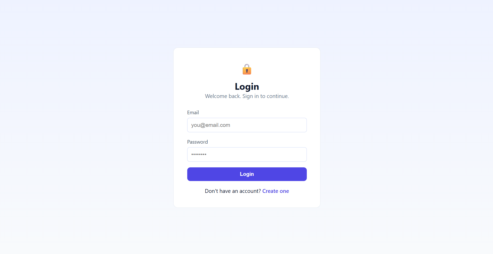

# Job Tracker

A full-stack web app I built to keep track of job applications and where I am in the hiring process. Users can create an account, add applications, update their status, and filter through them from one dashboard.



## Features

- Create an account and log in securely
- Add and manage job applications
- Track company, position, status, and other application details
- Update applications as they move through the hiring process
- Filter applications by status
- Keep each user's applications private through authentication

## Screenshots

### Applications

View and manage all job applications in one place.



### Filter by Status

Filter applications based on their current status to quickly find what you're looking for.



### Login

Users can log in to access their own application dashboard.



## Tech Stack

### Frontend

- React
- Vite
- React Router
- CSS

### Backend

- Node.js
- Express.js
- SQLite
- JWT authentication

## Project Structure

```text
JobTrackerApp/
├── client/
│   └── src/
│       ├── App.jsx
│       └── index.css
├── screenshots/
│   ├── applications.png
│   ├── dashboard.png
│   ├── login.png
│   └── status-filter.png
├── server/
├── .gitignore
└── README.md
```

## How It Works

The React frontend communicates with the Express backend through REST API requests. The backend handles authentication and application data, while SQLite is used to store users and their job applications.

JWT authentication is used to protect user-specific routes so that each user can only access their own application data.

## Running Locally

Clone the repository:

```bash
git clone https://github.com/gabrielaiduarte/job-tracker
cd JobTrackerApp
```

### Start the backend

```bash
cd server
npm install
npm run dev
```

### Start the frontend

Open another terminal:

```bash
cd client
npm install
npm run dev
```

Then open the local URL provided by Vite in your browser.

## What I Learned

This project gave me more experience building a full-stack application from frontend to backend. I worked with REST APIs, authentication, protected routes, database operations, and connecting a React frontend to an Express backend.
